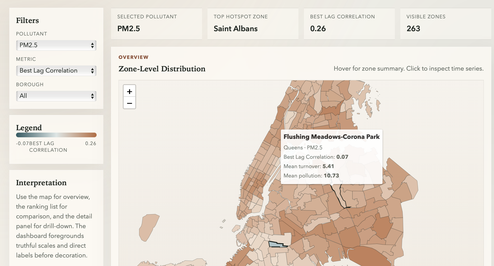
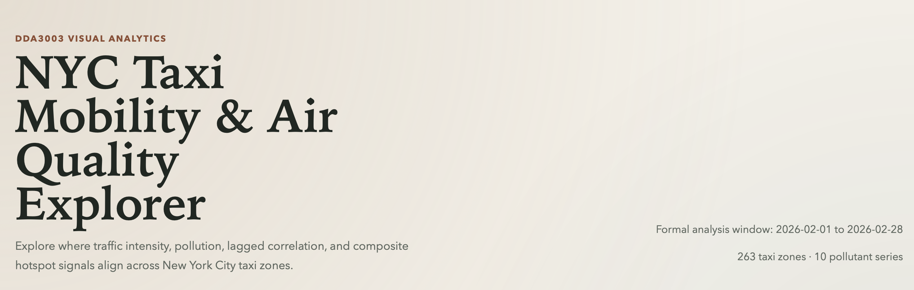
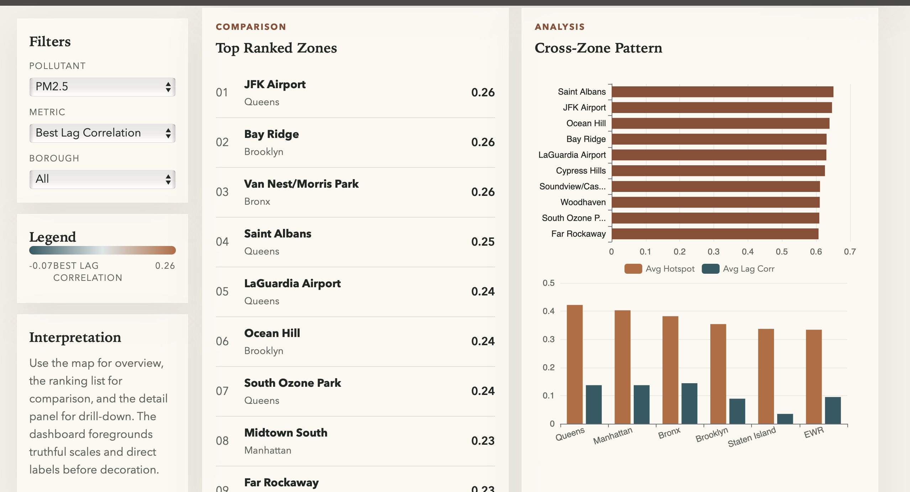
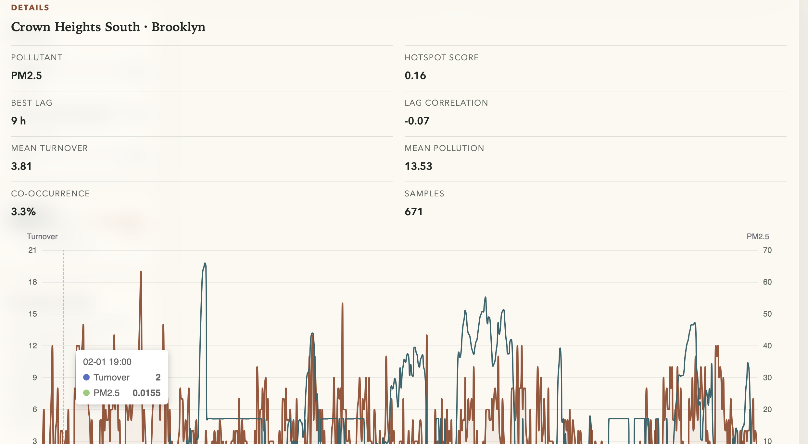

# NYC Taxi Mobility & Air Quality Explorer

Presentation notes for group members.  
Language: English  
Purpose: explain the website clearly to the instructor during the demo.

---

## 1. Project Overview

This website is an interactive visual analytics tool for exploring the relationship between **taxi mobility** and **air quality** in New York City.

It combines:

- NYC taxi trip data
- OpenAQ air quality data
- NYC taxi zone boundaries

The current prototype uses a **one-month formal analysis window**:

- **2026-02-01 to 2026-02-28**

The main goal is to help users answer three questions:

1. Which zones are most important?
2. How do traffic activity and pollution vary across space?
3. Is there a possible lagged relationship between traffic and pollution?

---

## 2. Main Analysis Logic

The website is based on a statistical analysis pipeline instead of only static charts.

Our main method includes:

- **Zone-hour aggregation**  
  Taxi trips are aggregated into hourly transport activity for each taxi zone.

- **Anomaly construction**  
  We compare current values with each zone's usual hourly pattern.

- **Lag correlation**  
  We test whether traffic change and pollution change are most related at the same time or after several hours.

- **Hotspot scoring**  
  We combine multiple indicators to identify zones that deserve attention.

This means the website shows not only "high" or "low" values, but also possible relationships between mobility and pollution.

---

## 3. What the User Can Learn from the Website

The website helps the user obtain four kinds of information:

- **Spatial information**  
  Which zones have higher pollution, stronger traffic activity, or stronger traffic-pollution relationships.

- **Comparison information**  
  Which zones or boroughs rank higher under the selected metric.

- **Temporal information**  
  How traffic and pollution change over time in a selected zone.

- **Interpretation information**  
  Whether there may be a lagged relationship between mobility and pollution.

In short, the website supports:

- overview
- comparison
- drill-down
- interpretation

---

## 4. How to Read the Website

Recommended order for the demo:

1. Start with the **Filters** on the left.
2. Use the **Map** for an overview of all zones.
3. Use the **Ranking list** to compare important zones quickly.
4. Click one zone to open the **Details panel**.
5. Explain the **time series chart** and summary metrics.

This matches the standard visual analytics sequence:

- overview first
- comparison second
- details on demand

---

## 5. Key Terms Explained

### Pollutant
An air quality variable, such as:

- PM2.5
- NO2
- O3
- CO

### Borough
A major administrative area in New York City, such as Manhattan, Brooklyn, Queens, Bronx, or Staten Island.

### Zone
A taxi zone, which is a smaller area used in NYC taxi trip data.

### Zone-level
Values are calculated for each taxi zone, not for the whole city.

### Zone-hour
One zone in one hour.  
This is the main unit of analysis used in the project.

### Metric
The variable currently shown on the map color scale.

Examples:

- Mean Turnover
- Mean Pollution
- Best Lag Correlation
- Hotspot Score

### Mean Turnover
Average transport activity in a zone.

In this project:

- **turnover = pickup count + dropoff count**

So **mean turnover** means the average hourly taxi activity in that zone.

### Mean Pollution
Average pollution value in a zone during the selected time period.

### Lag
A delay in time between traffic change and pollution change.

### Best Lag
The number of hours that gives the strongest relationship between traffic activity and pollution.

### Correlation
A measure of how strongly two variables move together.

- positive: they tend to increase together
- negative: they tend to move in opposite directions
- near zero: weak relationship

### Best Lag Correlation
The strongest positive traffic-pollution relationship found across different lag hours.

### Hotspot Score
A combined score used to highlight important zones.

It is based on:

- lag strength
- co-occurrence of traffic and pollution anomalies
- average pollution level

Higher hotspot score means the zone deserves more attention.

### Co-occurrence
How often high traffic anomaly and high pollution anomaly appear together.

### Samples
How many valid hourly records were used for that zone and pollutant.

### Legend
The visual key that explains what the colors on the map mean.

### Overview
Looking at the whole city pattern first.

### Drill-down
Clicking one zone to inspect more detailed information.

---

## 6. Screenshot 1: Header / Project Identity

### What this part shows

- The project title: **NYC Taxi Mobility & Air Quality Explorer**
- A short description of the system goal
- The formal analysis window
- The number of taxi zones and pollutant series currently included

### Why this matters

- It gives context before the user sees the map.
- It clearly tells the teacher that this is an interactive analysis system.
- It defines the scope of the current prototype.

### What to say

> This header explains the project purpose and the current analysis scope.  
> At the moment, the prototype uses a one-month formal analysis window and covers 263 taxi zones and 10 pollutant series.

---

## 7. Screenshot 2: Overview Map

### Main areas on this page

- **Filters**
- **KPI cards**
- **Zone-Level Distribution map**
- **Legend**
- **Interpretation box**

### Filters

The filter panel lets the user change:

- **Pollutant**: which pollutant to inspect
- **Metric**: which analysis result is shown by map color
- **Borough**: whether to view all zones or only one borough

### KPI Cards

These cards summarize the current filtered state:

- **Selected Pollutant**
- **Top Hotspot Zone**
- **Best Lag Correlation**
- **Visible Zones**

### Map

The map shows all NYC taxi zones colored by the selected metric.

The user can:

- hover over a zone to see a short summary
- click a zone to inspect detailed time series
- zoom and pan to inspect different areas

### Legend

The legend explains the map color scale.

This is important because without a legend, the colors would have no exact meaning.

### Interpretation Box

This short text guides first-time users:

- use the map for overview
- use ranking for comparison
- use details for drill-down

### What to say

> This is the overview page.  
> The user first chooses a pollutant and a metric, then uses the map to see spatial differences across all taxi zones.  
> Hover gives a quick summary, while clicking one zone opens the detailed analysis.

---

## 8. Screenshot 3: Comparison and Cross-Zone Analysis

### Left side: Top Ranked Zones

This list shows the highest-ranked zones under the selected metric.

Why it is useful:

- easier to compare than reading only the map
- quickly identifies the most important zones
- the user can click a ranked zone and inspect it in detail

### Right side: Cross-Zone Pattern

This section compares zones and boroughs at a higher level.

The current prototype shows:

- top hotspot zones
- borough-level averages

Why it is useful:

- it connects local zone findings and city-wide patterns
- it helps the user compare boroughs directly
- it supports explanation during the presentation

### What to say

> This section is for comparison.  
> The ranked list helps us identify the most important zones quickly, while the analysis charts summarize broader cross-zone and borough-level patterns.

---

## 9. Screenshot 4: Details Panel

### What this panel shows

After clicking one zone, the details panel displays:

- zone name
- borough
- pollutant
- hotspot score
- best lag
- lag correlation
- mean turnover
- mean pollution
- co-occurrence
- sample count
- time series chart

### Time Series Chart

The chart compares:

- transport activity over time
- pollution over time

This helps the user inspect:

- whether peaks happen together
- whether traffic and pollution seem aligned
- whether there may be delayed effects

### Why this matters

This is the most important drill-down view because it turns a map-level observation into a concrete zone-level explanation.

### What to say

> This panel shows detailed information for one selected zone.  
> It combines summary statistics and a time series chart so we can move from city-wide overview to a specific local example.

---

## 10. What Is Valuable About This Website

The value of the website is not only that it shows data.

Its real value is that it lets users:

- find spatial hotspots
- compare zones and boroughs
- inspect one zone in detail
- understand possible lagged relationships between traffic and pollution

So the website is a **visual analytics interface**, not just a collection of charts.

---

## 11. What We Can Say About Current Findings

The current results should be presented as **preliminary findings**.

They already show that:

- traffic and pollution relationships are not uniform across the city
- some zones are much more important than others
- different pollutants show different spatial patterns
- lag effects may exist and may vary by pollutant and zone

However, these are still early findings based on the current formal one-month analysis window.  
They should be presented as meaningful exploration results, not final causal conclusions.

### Safe sentence to use

> The current dashboard already reveals meaningful spatial and temporal differences between transport activity and pollution, but the findings should still be treated as preliminary because they are based on an early one-month formal analysis window.

---

## 12. Short Presentation Script

> This website is our interactive visual analytics system for exploring the relationship between taxi mobility and air quality in New York City.  
> We combine taxi trip data, air quality monitoring data, and taxi zone boundaries, then aggregate the data at the zone-hour level.  
> Our main analysis includes transport aggregation, anomaly construction, lag correlation, and hotspot scoring.  
> On the website, users can first use the map for overview, then compare important zones and boroughs, and finally click one zone to inspect detailed time series and summary statistics.  
> In this way, the website supports overview, comparison, and drill-down, which is one of the key goals of interactive visual analytics.

---

## 13. One-Sentence Summary

> Our website helps users explore where, when, and how taxi mobility and air pollution may be related across New York City through interactive visual comparison.
